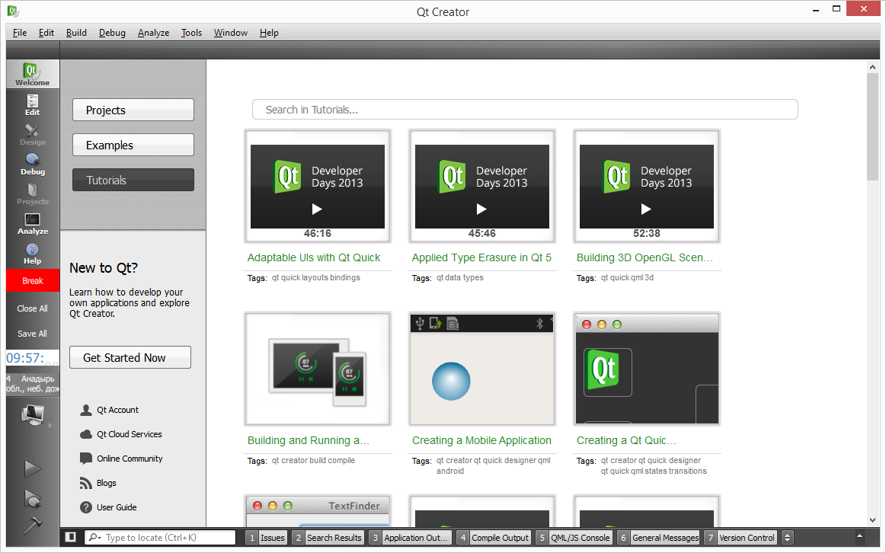

#JsExtensions Plugin
This QtCreator plugin enables writting plugins using JavaScript/QML
#Overview
Plugin allows easily write simple additions to QtCreator called jep plugins (*.jep.js files).
Jep plugin file is a JavaScript file with the most QtCreator API avaliable there.
No need to clone QtCreator sources and build them to develop jep plugins.

You can get precompiled plugin for Linux(Ubuntu) [here](https://github.com/lexxmark/QtCreator-JsExtensions-Plugin/blob/master/package/LexxmarkLinux64.tar.gz). Just unzip Lexxmark folder to the QtCreator plugins folder (you may be need to change version of dependency Core in JsExtensions.pluginspec file - valid from 3.0.0 till 3.1.1).

These are screenshots of the jep plugins:




Video you can see [here](http://youtu.be/GGCcGts3B2I) and [here](http://www.youtube.com/watch?v=VHhEt3un_f4).

You can see 5 additional elements on the mode panel (left side):

1. Green box with "Work" label is a [RelaxTracker](https://github.com/lexxmark/QtCreator-JsExtensions-Plugin/tree/master/plugins/RelaxTracker). This is QQuickView window which periodically flashes with red box and label "Break" (to remind user to have a break).
2. "Close All" button closes all opened documents [see](https://github.com/lexxmark/QtCreator-JsExtensions-Plugin/blob/master/plugins/CloseAllBttn/CloseAllBttn.jep.js).
3. "Save All" button saves all modified documents [see](https://github.com/lexxmark/QtCreator-JsExtensions-Plugin/blob/master/plugins/SaveAllBttn/SaveAllBttn.jep.js).
4. Digital Clocks box animates current time [see](https://github.com/lexxmark/QtCreator-JsExtensions-Plugin/tree/master/plugins/Clock).
5. Weather box shows current weather conditions [see](https://github.com/lexxmark/QtCreator-JsExtensions-Plugin/tree/master/plugins/Weather).

#How to write jep plugins
At QtCreator startup JsExtensions plugin scans Lexxmark folder and subfolders for *.jep.js files. It tries to load each *.jep.js file, looks for "initialize" function inside and executes it. We can write minimal jep plugin like this:

```JavaScript
function initialize() {
    // write message to General Messages panel with flashing
    messageManager.write("Jep plugin has started!", 512);
}
```

There are two optional functions **extensionsInitialized()** and **aboutToShutdown()** that will be called in JsExtensionsPlugin::extensionsInitialized and JsExtensionsPlugin::aboutToShutdown functions. Also there are three optional variables to manage jep plugins:

1. **pluginOrder** - numeric variable to change loading order (for example "var pluginOrder = 1;")
2. **pluginDisable** - bool variable to abort plugin loading (for example "var pluginDisable = true;")
3. **pluginTrace** - bool variable to trace all wrappers calls to log file (for example "var pluginTrace = true;")

In global object of the JavaScript/QML environment were added several objects to access QtCreator API:

1. **core** - wraps Core::ICore
2. **messageManager** - wraps Core::MessageManager
3. **actionManager** - wraps Core::ActionManager
4. **editorManager** - wraps Core::EditorManager
5. **modeManager** - wraps Core::ModeManager
6. **jepAPI** - collection of utility functions

In addition to singleton objects there are wrappers for some other classes:

1. Core::ActionContainer
2. Core::Command
3. Core::IDocument

**NOTE: "Clocks" plugin was disabled in linux by default because of two parallel QML windows with animations will lead to crash see [QTBUG-38221](https://bugreports.qt-project.org/browse/QTBUG-38221)**