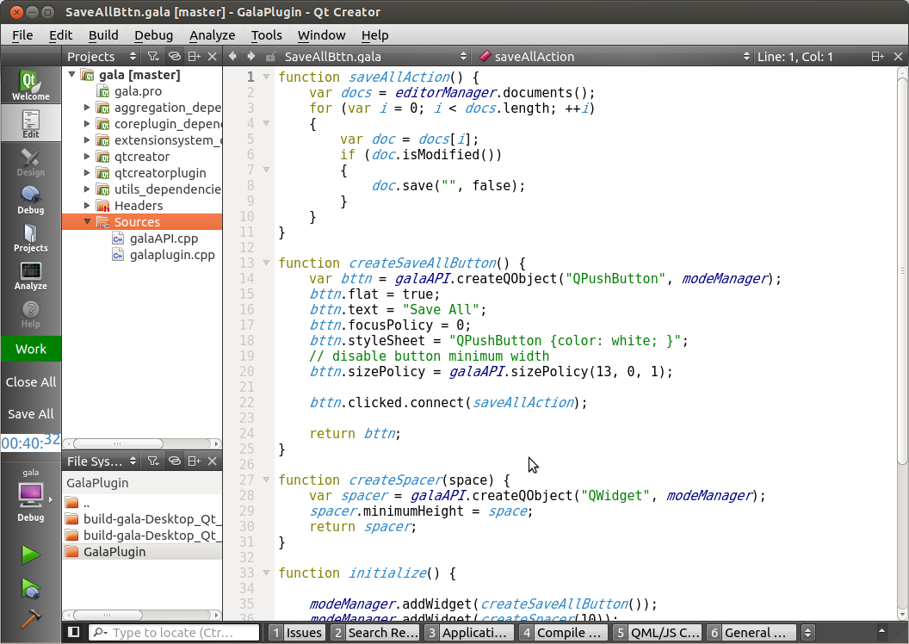

#GalaPlugin
QtCreator plugin which enables writting plugins using JavaScript/QML
#Overview
This plugin allows esily write simple additions to QtCreator called gala plugins (*.gala files).
Gala plugin file is a JavaScript file with the most QtCreator API avaliable there.
No need to clone QtCreator sources and build them to develop gala plugins.
You can get precompiled plugin for Linux(Ubuntu) [here](https://github.com/lexxmark/GalaPlugin/blob/master/package/Lexxmark.tar.gz). Just unzip Lexxmark folder to the plugins folder of the QtCreator.

Here is a screenshot of the Demo gala plugins:


You can see 4 additional elements on the mode panel (left side):

1. Green box with "Work" label is a [RelaxTracker](https://github.com/lexxmark/GalaPlugin/tree/master/plugins/RelaxTracker). This is QQuickView window which periodically flashes with red box and label "Break" (to remind user to have a break).
2. "Close All" button closes all opened documents [see](https://github.com/lexxmark/GalaPlugin/blob/master/plugins/CloseAllBttn/CloseAllBttn.gala).
3. "Save All" button saves all modified documents [see](https://github.com/lexxmark/GalaPlugin/blob/master/plugins/SaveAllBttn/SaveAllBttn.gala).
4. Digital Clocks box animates current time [see](https://github.com/lexxmark/GalaPlugin/tree/master/plugins/Clock).

#How to write gala plugins
At QtCreator startup GalaPlugin scans Lexxmark folder and subfolders for *.gala files. Tries to load each *.gala file and looks for "initialize" function there and executes it. We can write minimal gala plugin like this:

```JavaScript
function initialize() {
    // write message to General Messages panel with flashing
    messageManager.write("Gala plugin has started!", 512);
}
```

There are two optional functions "extensionsInitialized" and "aboutToShutdown" that will be called in GalaPlugin::extensionsInitialized and GalaPlugin::aboutToShutdown functions. Also there are two optional variables to manage gala plugins:

1. **galaPluginOrder** - numeric variable to change loading order (for example "var galaPluginOrder = 1;")
2. **galaPluginDisable** - bool variable to abort plugin loading (for example "var galaPluginDisable = true;")

In global object of the JavaScript/QML environment was added several objects to access QtCreator API:

1. **core** - wraps Core::ICore
2. **messageManager** - wraps Core::MessageManager
3. **actionManager** - wraps Core::ActionManager
4. **editorManager** - wraps Core::EditorManager
5. **modeManager** - wraps Core::ModeManager
6. **galaAPI** - collection of utility functions

In addition to singleton objects there are wrappers for some other classes:

1. Core::ActionContainer
2. Core::Command
3. Core::IDocument

**NOTE: Clocks plugin was disabled by default because two parallel QML windows with animations will lead to crash see [QTBUG-38221](https://bugreports.qt-project.org/browse/QTBUG-38221)**